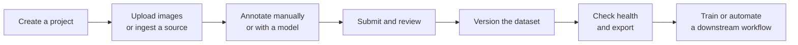
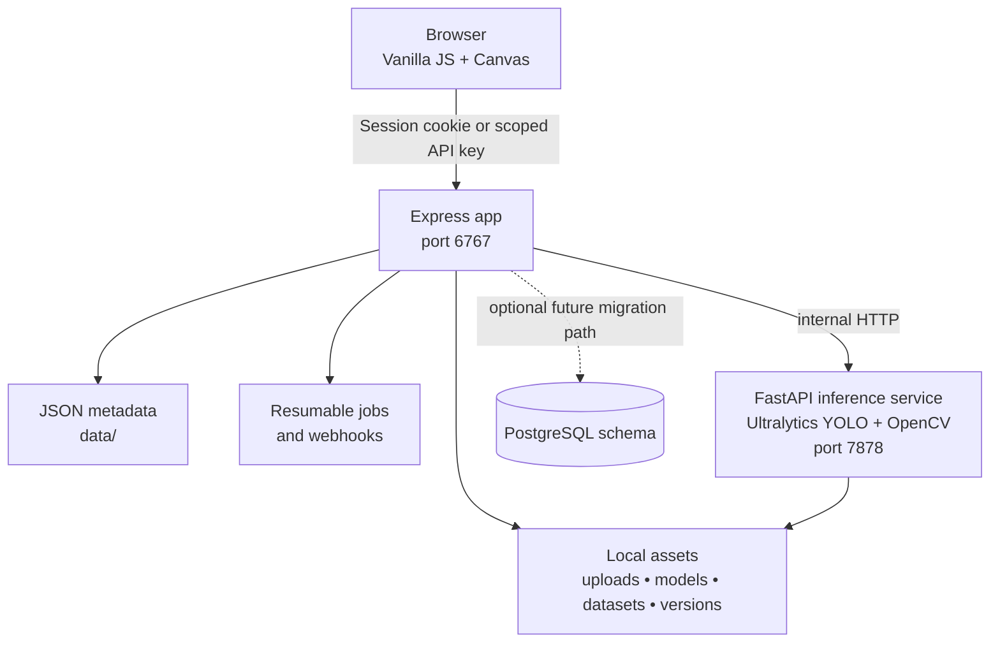

# LibreFlow Annotate

> A local-first annotation and dataset-operations workspace for computer-vision teams.

   

<p align="center">
  
</p>

## The idea

Computer-vision data work commonly fragments across file shares, point annotation tools, model scripts, review spreadsheets, and export utilities. LibreFlow Annotate brings that loop together in a self-hosted application: get images in, label them with rich geometry, review the work, create an immutable dataset snapshot, and hand a verified export to training or downstream automation.

Online sources are also too expensive and restrictive especially those with token-based systems just to run a simple inference as well as limited or metered API integration with automation workflows.

The project is deliberately local-first. The supported runtime stores application records and uploaded assets on the operator's machine, while model inference runs in a companion local Python service. That makes it a practical prototype for sensitive inspection imagery, laboratory work, and small teams that want control of their data. With this, the user has the power to run all of the inferences that they want with no token limitations as well as integrate their own automation workflows to use LibreFlow to automate the inference of datasets for model improvement.

## Showcase

| Area | What the current iteration demonstrates |
| --- | --- |
| Annotation | Boxes, rotated boxes, polygons, masks, lines, points, skeletons, classifications, label management, keyboard shortcuts, undo/redo, and non-destructive revision restore. |
| Team workflow | Project collaboration, reviewer assignment, submitted/approved/change-requested states, comments, annotation-linked issues, notifications, and audit queues. |
| Model assistance | YOLO detection/classification auto-annotation and Smart Mask point prompting with a compatible SAM model. |
| Dataset engineering | YOLO/COCO/Pascal VOC import, exports, deterministic splits, immutable content-addressed versions, augmentation lineage, and health diagnostics. |
| Automation | Scoped API keys, a dependency-free CLI, resumable jobs, URL/folder/S3-compatible connectors, signed webhooks, and delivery history. |
| Deployment | Local Node + Python services or Docker Compose. An opt-in PostgreSQL schema is included as a migration foundation. |

## A representative flow



## How the system is put together



The browser never calls the Python service directly. Express applies project access checks before serving protected files or proxying model work. The supported persistence mode is JSON-backed local storage; PostgreSQL is currently an opt-in schema/migration foundation and is not wired into the live application store.

## Quick start

### Local development

Requirements: Node.js 20.9+, Python 3.10+, and npm.

```powershell
npm install
py -3.10 -m venv py_scripts\.venv
py_scripts\.venv\Scripts\pip install -r py_scripts\requirements.txt
.\start_app.ps1
```

Open `http://localhost:6767` and register a local account. The launcher starts the Express app and the inference service. For manual commands and macOS/Linux instructions, see [Setup](docs/setup.md).

### Docker Compose

```powershell
docker compose up --build
```

Open `http://localhost:6767`. Compose preserves local runtime state through bind mounts for `data/`, `uploads/`, `models/`, `datasets/`, and `versions/`. Stop it with `docker compose down`.

## Use cases

- Industrial visual inspection: annotate defects, route samples through review, analyze class balance, and export a reproducible training release.
- Research datasets: keep experiments tied to deterministic versions, transformations, split seeds, and lineage metadata.
- Human-in-the-loop model improvement: use inference to draft labels, verify them in review, and retrain from immutable snapshots.
- Private or offline workflows: operate on a local machine or controlled network with locally mounted image/model storage.
- Pipeline integration: ingest approved sources, queue batch inference, and notify training/operations systems through scoped keys and signed webhooks.

## Documentation

The MkDocs site is the current technical source of truth:

- [Documentation home](docs/index.md)
- [Architecture and technologies](docs/architecture.md)
- [Setup and operations](docs/setup.md)
- [End-to-end usage](docs/usage.md)
- [API reference](docs/api-reference.md)
- [Review and quality](docs/review-and-quality.md)
- [Dataset lifecycle](docs/dataset-lifecycle.md)
- [Automation API and CLI](docs/automation-api.md)

Serve it locally after installing MkDocs Material:

```powershell
py -m pip install mkdocs-material
mkdocs serve
```

## API and automation

The browser UI uses authenticated session routes. Persistent automation also supports scoped Bearer keys created from **Jobs → Automation**.

```powershell
$env:LIBREFLOW_URL = "http://localhost:6767"
$env:LIBREFLOW_API_KEY = "lfk_..."
npm run cli -- projects list
npm run cli -- jobs list
```

The [API reference](docs/api-reference.md) documents core routes and auth boundaries; [Automation API](docs/automation-api.md) includes API-key scopes, job, ingestion, connector, webhook, and CLI contracts.

## Current scope and honest limits

LibreFlow is an active prototype intended for local/self-hosted teams. JSON persistence is the supported default and requires regular folder-level backups. The optional PostgreSQL profile creates relational schema only; it does not migrate the running application to a database. Large-model performance depends on the available CPU/GPU and matching PyTorch setup. Deployments exposed beyond a trusted network need production session secrets, HTTPS/reverse-proxy hardening, access controls, and carefully restricted ingestion/webhook settings.

## Project structure

```text
LibreFlow-Annotate/
  bin/            Automation CLI
  docs/           MkDocs documentation source
  lib/            Access, jobs, lifecycle, integration, and storage services
  middleware/     Session and API-key authentication
  public/         Browser UI
  py_scripts/     FastAPI inference service
  routes/         Express route handlers
  db/             Optional PostgreSQL schema and migration tool
  data/           Runtime metadata (gitignored)
  uploads/        Project images (gitignored)
  models/         Uploaded model files (gitignored)
  datasets/       Dataset assets (gitignored)
  versions/       Immutable dataset snapshots (gitignored)
```

## License

Released under the [Apache License 2.0](LICENSE).
