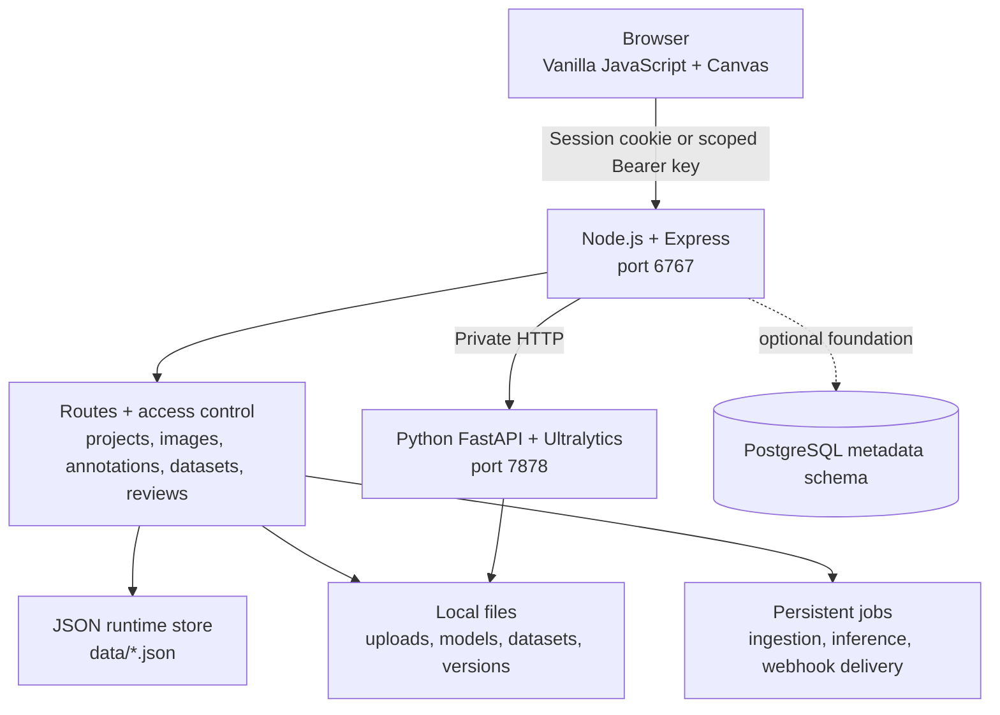

# Architecture

LibreFlow is a two-service, local-first application. The browser speaks to an Express web application; Express persists local records and coordinates a companion FastAPI inference process. The browser never calls the inference service directly.

## Runtime components

### Browser application

The frontend is plain HTML, CSS, and browser JavaScript served from `public/`; it has no bundler requirement. The canvas annotator owns interactive drawing and editing. Pages cover projects, datasets, models, jobs, lifecycle analysis, and review workflows.

### Express application

`server.js` hosts the UI and mounts route modules under `/api`. It uses cookie sessions for the browser UI and a hybrid authentication layer for selected automation and dataset-lifecycle APIs. Access checks are applied before protected files and resources are served.

### Inference service

`py_scripts/infer_server.py` is a FastAPI service for model loading, YOLO inference, and prompted segmentation. The Express model routes proxy the relevant authenticated requests to it. This separation prevents the browser from gaining direct file-system/model access.

### Local storage

The default store is JSON files under `data/`. Image uploads, model files, exported/standalone dataset assets, and immutable version assets live in separate local folders. These folders are runtime state and should be backed up together; they are not source-controlled.

The `db/` folder provides an opt-in PostgreSQL schema/migration path for relational metadata. It is not yet connected to the application’s live read/write path, so it must not be treated as production persistence.

## Security boundaries

- Browser routes use an HTTP-only session cookie after local login.
- Automation API keys are scoped, hashed at rest, and can be limited to projects.
- Uploaded image, model, and dataset file routes validate the requester’s membership before serving a file.
- Automation ingestion validates input images and has allowlists/size limits. Private network URL targets are off by default.
- Webhook destinations are validated to reduce SSRF risk; delivery secrets are encrypted at rest and requests use HMAC signatures.

## Deployment choices

For development, run the Node and Python services locally. Docker Compose runs the same two services and bind-mounts `data/`, `uploads/`, `models/`, `datasets/`, and `versions/` into the containers, preserving the file-path contract required for inference. The optional PostgreSQL profile is separate from the supported JSON demo store.

## Technologies used

| Layer | Technologies |
| --- | --- |
| Frontend | Vanilla JavaScript, HTML, CSS, Canvas API |
| Application server | Node.js, Express, express-session, Multer, Sharp, bcryptjs |
| Data formats | JSON, YAML, ZIP, CSV, COCO JSON, Pascal VOC XML, YOLO layouts |
| ML inference | Python, FastAPI, Uvicorn, Ultralytics YOLO, OpenCV, NumPy |
| Automation | Node CLI, scoped Bearer keys, HMAC-SHA256 webhooks, optional AWS S3 SDK |
| Packaging | Docker, Docker Compose; optional PostgreSQL 16 foundation |
