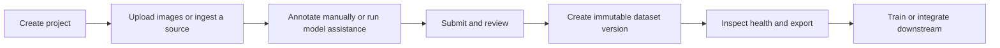

# LibreFlow Annotate

LibreFlow Annotate is a local-first workspace for building computer-vision datasets. It brings image ingestion, rich annotation, collaborative review, model-assisted labeling, reproducible dataset versions, and workflow automation into one self-hosted application.

## What it is for

Use LibreFlow when a vision team needs to move from raw images to a reviewable, exportable training dataset without moving sensitive image data to a third-party labeling service. It is especially suited to industrial inspection, quality assurance, research prototypes, and small-to-medium annotation teams that want a deployable local workflow.

## Current product status

LibreFlow is an active local/self-hosted prototype. The JSON-backed store is the supported default. An opt-in PostgreSQL schema and migration tool are included as a foundation, but the running application does not yet read or write its data through PostgreSQL. Model inference is performed by a companion local FastAPI service and requires compatible YOLO/SAM model files.

## Core capabilities

| Area | What LibreFlow provides |
| --- | --- |
| Annotation | Bounding boxes, rotated boxes, polygons, masks, lines, points, skeletons, classifications, revision history, and non-destructive restore. |
| Collaboration | Project membership, reviewer assignment, comments, annotation-linked issues, audit views, and a shared review state machine. |
| Model assistance | Uploaded YOLO models for detection/classification auto-annotation plus prompted Smart Mask segmentation when a compatible SAM model is available. |
| Dataset operations | Project and standalone datasets, imports, exports, deterministic split assignment, immutable snapshots, processing/augmentation lineage, and health reports. |
| Automation | Scoped API keys, resumable inference and ingestion jobs, a Node CLI, signed webhooks, URL/folder/S3-compatible ingestion, and delivery history. |

## Typical workflow

## Read next

- [Set up LibreFlow](setup.md) for local and Docker installation.
- [Use LibreFlow](usage.md) for the end-to-end UI workflow.
- [Understand the architecture](architecture.md) for deployment, storage, and security boundaries.
- [Use the API](api-reference.md) for browser-session and scoped-key endpoints.
